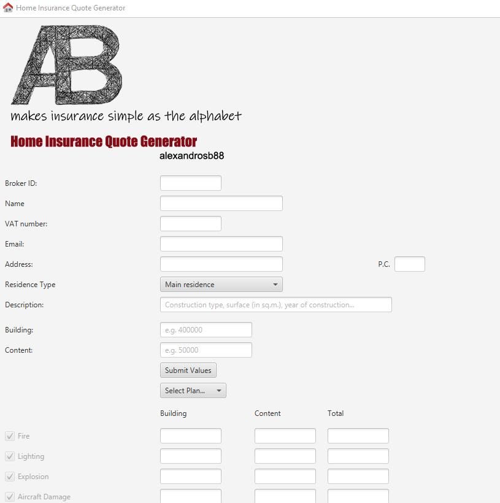
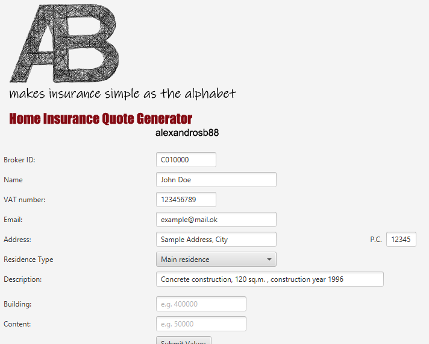
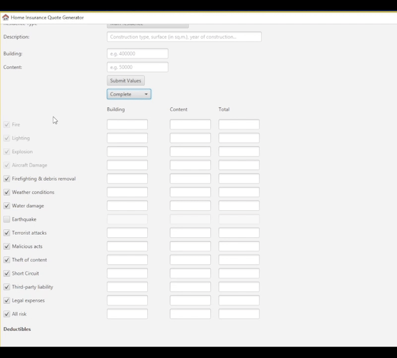
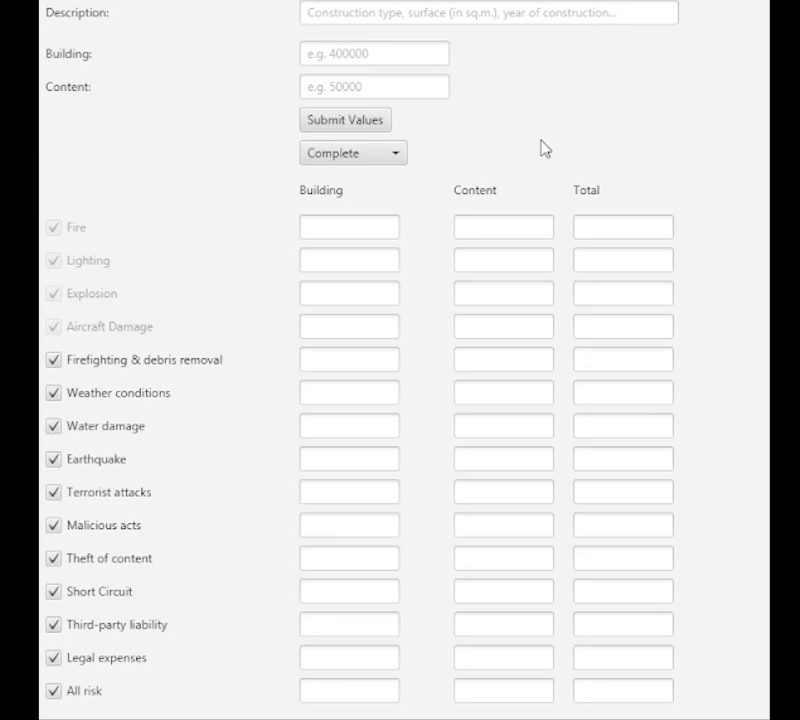
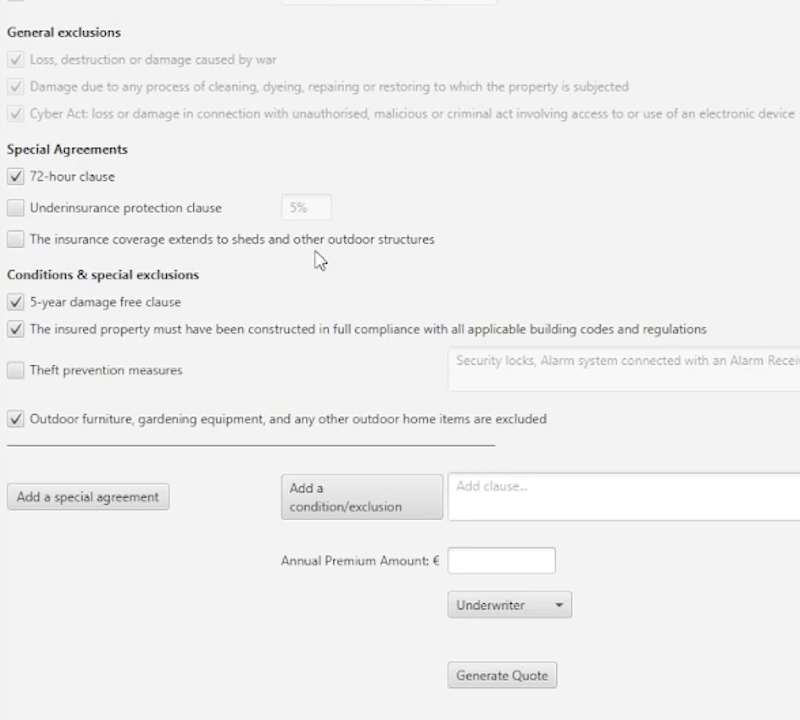
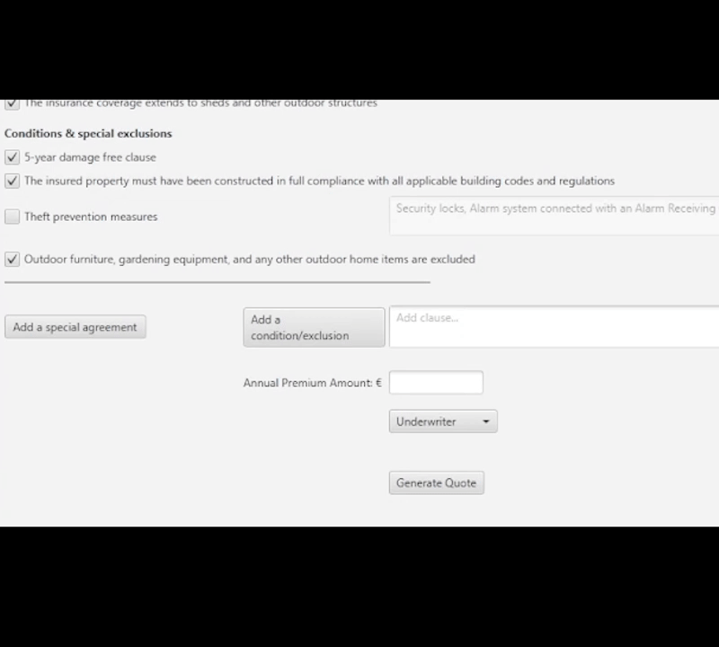
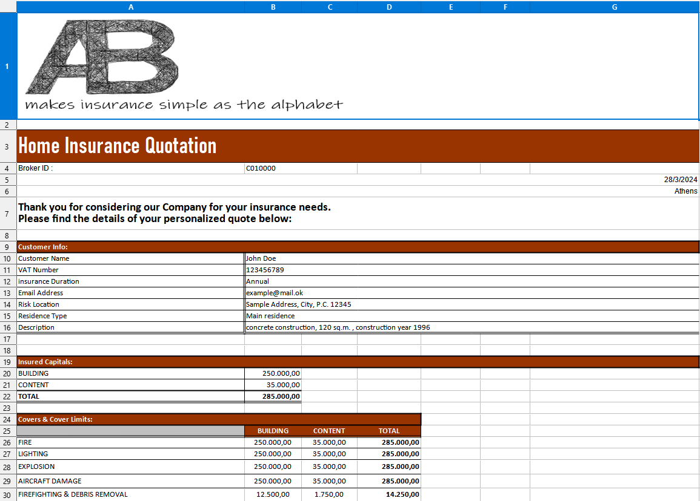
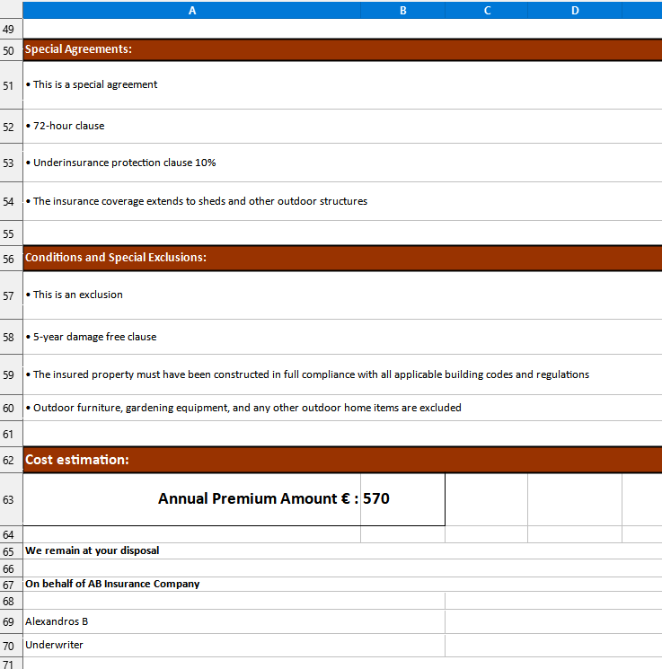

# Home Insurance Quote Generator

## Description

> ### Java/Java FX application for generating tailor-made home-insurance quotes
 
 

This is a sample of a real-world application. 

In order to showcase its funcionality, it is recreated for a ficticious insurance company "AB Insurance".

Main Screen:

## Usage
 

> *(click each section to expand)*

 

Entering Basic Info

 

Firstly, the user provides basic information that wishes to be included in the quotation:

Selecting Covers/Deductibles

 

The initial option involves selecting a plan wherein predetermined coverage components are automatically checked:

However, the user retains the ability to check/uncheck any specific coverage item or condition individually:

> **Note**  
This latter feature embodies the tailor-made element, as it allows users to personalize the coverage.
 

When a cover is selected, the relative field appears in the deductible section. If a deductible box is checked, the text is open for editing:

Submitting the Values (Building/Content)

 

After selecting the desired covers, the user is then required to input the insured value for building and/or content. By pressing the "Submit" button, a set of pre-configured rules get into action and automatically calculate the limit of the selected covers:

Selecting Conditions/Special Agreements

 

There is capability to review and adjust contract clauses as needed: 

> **Note**  
Regarding General Exclusions, given their obligatory nature, the relative fields are locked and not editable  (However, this feature could be easily adjusted in source code level)

Adding Conditions/Special Agreements

 

Any contract clause that may not be initially included can be manually appended:

Generating the Quote

 

Finally, by pressing "Generate Quote" the quote is delivered in XLS format based on an xls source file:

 

 

Automation is the key to success!

 

Apart from the main capabilities for covers, limits etc. other automations can be implemented based on the user needs and underwriting rules.
 
 
For example, if the user selects "Secondary Residence" as residence type, since it is more vulnerable to theft, the field of theft measures is automatically checked and open for editing.

## Notes

- The app could be adapted for use with business products as well
- Libre office and xls files were employed
- .ODS and .XLSX files could be utilized (minor changes in the code are necessary)

## License

This project is licensed under the [MIT License](LICENSE). You are free to use, modify, and distribute this project as per the terms of the license.
